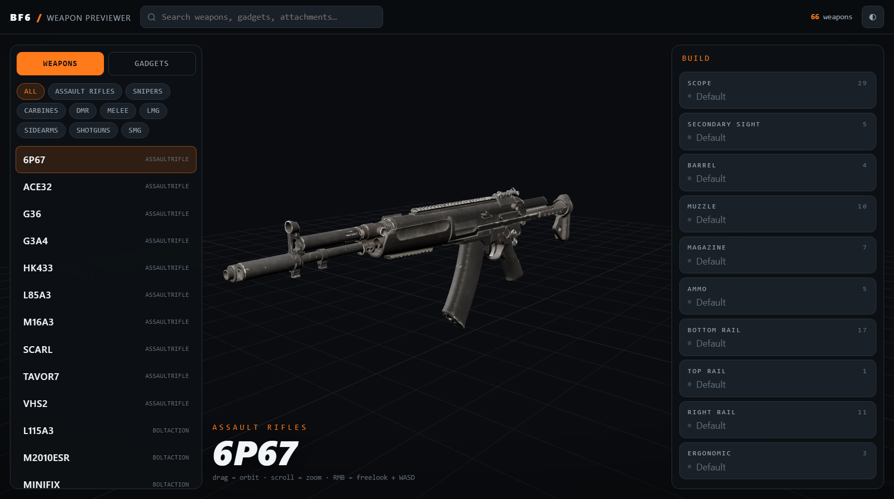

# BF6 Weapon Previewer

Browser-based 3D armory for Battlefield 6: pick any weapon, swap attachments per
slot, and preview the result — plus gadgets and throwables. Slot lists and
weapon→attachment compatibility come straight from the game's own data, so only
combinations the game actually allows are offered.



## Features

- Full-screen 3D stage: orbit / scroll zoom / RMB freelook + WASD fly
- 66 weapons (battle pickups included), 4,600+ real weapon×attachment pairs
  across 11 slots (Scope, Secondary Sight, Barrel, Muzzle, Magazine, Ammo,
  Bottom/Top/Left/Right Rail, Ergonomic)
- In-game names for weapons, gadgets and attachments, joined from the
  Portal SDK item catalog (see `docs/COVERAGE-AUDIT.md`)
- Weapon skins, 157 tiling camo patterns, and 226 weapon charms
- Gadgets & throwables browser
- First-person-grade meshes with full-resolution PBR textures

## Run locally

The site is static; models are served from a local staging folder.

```
python site/serve.py            # http://localhost:8087
```

Set `BF6WPN_MODELS` to point at your models folder (default `A:\bf6weapons\models`).

## Tools

Everything under `tools/` rebuilds the data from a local BF6 installation dump:

| tool | purpose |
|---|---|
| `scrape_armory.py` | build `data/armory_db.json` (weapons, parts, slots, compatibility, skins, gadgets) |
| `build_manifest.py` | produce `site/data/manifest.json` for the site |
| `convert_all_weapons.py` | batch-convert every weapon part / attachment / gadget mesh to textured GLB |
| `probe_weapon.py`, `check_tex_res.py`, `verify_hres.py`, `find_mip0.py`, `tex_res_sweep.py` | one-off verification utilities |

Mesh/texture conversion reuses the
[high-poly pipeline](https://github.com/TabbedScamper/BF6_High_Poly_Godot_Plugin)
tooling.
